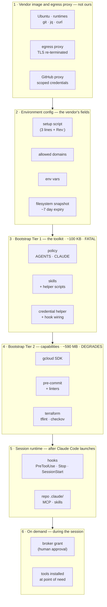
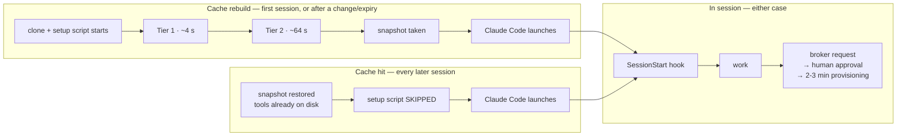

# Cloud sandbox: bootstrap and environment design

What the layers are, what runs when, and which layer owns which failure.

- **Operator manual**: [`cloud/README.md`](../cloud/README.md) — what to paste
  into which field, what each flag does, how to recover. This document is the
  reasoning; that one is the procedure.
- **Decisions**: [ADR-0016](../adrs/0016-capability-delivery-principles.md)
  (where capability lives), [ADR-0018](../adrs/0018-composing-agent-context-per-surface.md)
  (composing context per surface).
- **Tracking**: [#432](https://github.com/pmgledhill102/agentic-coding-config/issues/432).

Measurements here were taken on **2026-09-13** in a live `claude-cloud-sandbox`
session, container CLI 2.1.270, bootstrap ref `52969db`. Each one says how it
was taken, so it can be re-taken rather than trusted.

## 1. The six layers

The two bootstrap layers are split by **blast radius, not by cost**.

**Tier 1 is fatal** because a container with no policy and no skills is not a
degraded sandbox, it is a different machine — and an agent cannot discover from
the inside that its instructions never arrived. It is also the least likely to
fail: every step is a fetch from `raw.githubusercontent.com` plus a file write.

**Tier 2 degrades** because a container with skills, policy and hooks but no
`checkov` is a working container missing one gate. Killing the run over it
throws away everything of value to protect something worth much less. The
manifest records `status=degraded` and names what is missing.

That ordering was learned the hard way: Tier 1 used to run *last*, behind a
96 MB SDK, `apt`, `npm`, `pip` and three release tarballs, and a `checkov` that
could not install took the skills down with it.

## 2. The timeline — and why the cache changes the question

The layer diagram says what exists. This says **when it costs anything**, which
is the part no prose in this repo had captured.

The cache is documented behaviour: the setup script runs the first time, the
filesystem is snapshotted, later sessions restore the snapshot and **skip the
setup script**, and it re-runs only when the script text changes, the allowed
hosts change, or roughly seven days pass. Resuming an existing session never
re-runs it.

**This inverts the obvious optimisation.** On a cache-hit session, front-loaded
tools cost approximately zero wall-clock — they are already in the snapshot.
What they still cost is:

| Cost | Applies on | Size |
| --- | --- | --- |
| wall-clock in setup | rebuild only | ~68 s total, ~64 s of it Tier 2 |
| disk, against a 30 GB session allowance | **every session** | gcloud 493 MB, Terraform toolchain ~112 MB, rest ~40 MB |
| headroom under the 5-minute setup limit | rebuild only | ~68 s of 300 s used |
| snapshot size | rebuild only | not measurable from inside |

So "install later to start faster" is only true on rebuild sessions. The honest
reason to defer a tool is **disk and setup-limit headroom**, plus freshness. How
much that matters depends entirely on the **rebuild rate**, which nothing
currently measures — which is why
[#430](https://github.com/pmgledhill102/agentic-coding-config/issues/430)
(measure) comes before
[#323](https://github.com/pmgledhill102/agentic-coding-config/issues/323)
(defer gcloud).

The session that produced this document was itself a rebuild: container created
09:30:35Z, manifest `installed_at=09:32:33Z`, 118 seconds apart. Comparing those
two timestamps is a free cache-hit verdict and needs no platform feature.

## 3. Measurements

**Bootstrap, this container.** Phase costs are not yet emitted by the script
(#430); the totals below come from `/tmp/bootstrap.log` ordering plus the
on-disk sizes.

| Component | On disk |
| --- | --- |
| gcloud SDK | 493 MB |
| terraform | 85 MB |
| tflint | 27 MB |
| checkov | 27 MB |
| shellcheck | 19 MB |
| markdownlint-cli2 | 17 MB |
| actionlint | 4.9 MB |

**Egress, mid-session.** Method: ranged `GET` (`curl -r 0-0 -L`) against every
host the bootstrap fetches from, from inside the agent phase.

| Host | Result |
| --- | --- |
| `raw.githubusercontent.com` | 206 |
| `dl.google.com` | 206 · full 87 MB tarball in **1.6 s** |
| GitHub release assets | 206 |
| `releases.hashicorp.com` | 206 |
| `pypi.org`, `registry.npmjs.org` | 206 |
| `archive.ubuntu.com` | 206 |
| `registry.terraform.io` | 206 — **contradicts [#241](https://github.com/pmgledhill102/agentic-coding-config/issues/241)**, re-check before working it |
| `docs.cloud.google.com` | 403, as #241 records |

**The finding that matters**: on Claude, the setup script and the agent session
run under the **same allowlist**, so every install the bootstrap can do at build
time it can also do mid-session. No allowlist change is needed to defer a tool.
That is confirmed by the platform's own behaviour — a change to allowed hosts is
one of the three things that rebuilds the snapshot, precisely because the two
phases share the policy.

**Telemetry probes.** Both were unknown: the platform documents neither. Method:
a local OTLP collector on `127.0.0.1:4318`, a headers helper writing a marker,
one headless run with telemetry enabled — with a negative control first (a
hand-made POST proved the collector logged, so "nothing arrived" could be
distinguished from "the collector is broken").

- OpenTelemetry export **works** from a cloud sandbox: `session.count`,
  `token.usage`, `cost.usage`, `active_time.total`, and the `user_prompt`,
  `api_request`, `assistant_response`, `hook_registered` events.
- `otelHeadersHelper` **is invoked**, and its headers arrive on every request.
  It must return a JSON object of string key-value pairs.

One probe could not be run: declaring the helper in a *container-written*
`~/.claude/settings.json` was blocked in-session as self-modification. Recorded
on [#260](https://github.com/pmgledhill102/agentic-coding-config/issues/260)
rather than assumed.

## 4. The phase model is not universal

Every other platform splits setup-phase network from agent-phase network.
**Claude is the exception.**

| Platform | Setup network | Agent network | Cache | Setup limit | Agent-start hook |
| --- | --- | --- | --- | --- | --- |
| **Claude web** | one allowlist | **same allowlist** | FS snapshot, ~7 days | 5 min | `SessionStart`, every start and resume |
| **Codex cloud** | internet on | **off by default**; per-env allowlist, optional GET/HEAD/OPTIONS only | container state, 12 h | 10 min (20 Pro; 2025 figure) | maintenance script, on cache resume only |
| **Copilot** | **exempt from the firewall** | firewall + recommended allowlist | none automatic | 59 min | `sessionStart`, inside the firewall |
| **Cursor** | not documented | on by default | "Builds" snapshot, ~24 h | not documented | `start` command |
| **Devin** | build phase | not documented (cloud) | one org snapshot, ~24 h | steps time out at 1 h | `maintenance`, surfaced not executed |
| **Jules** | internet on | internet on | snapshot after setup | not documented | not documented |

Two consequences for anything this repo builds:

1. **A mid-session install is free on Claude and needs deliberate configuration
   on Codex**, where the agent phase is offline by default and a GET-only
   restriction would also block the broker, since its endpoints are POST.
2. **Setup-script exports do not survive into the Codex agent phase** — it runs
   setup in a separate shell — which is why `CREDENTIAL_BROKER_URL` and its key
   belong in the environment's own variable block on both surfaces.

## 5. Just-in-time installs: the verdict

The idea: stop front-loading tools, install them at the moment of need, and hide
the cost behind latency that already exists — the 2–3 minute wait while the
broker provisions a sandbox, for instance.

**Research across the eight weeks to 2026-09-13 found this is not an established
pattern.** Every in-window vendor move is the opposite: eager provisioning
hidden behind snapshots and warm pools. Cursor shipped "Builds" on 2026-08-13 —
background-refreshed snapshots with last-good-build fallback. Codex caches
container state for 12 hours and auto-installs from lockfiles. There is public
evidence of container pre-warming on Claude. The only vendor endorsement of
install-on-miss is a single line in the Claude hooks documentation, about
*plugin* dependencies. Community practice is check-before-install `SessionStart`
hooks that skip when `command -v` succeeds.

Combined with §2 — the cache means front-loading is nearly free on the sessions
that matter — the original framing does not survive contact with the evidence.

**What does survive is a different shape.** Not "install late", but:

> One idempotent, check-before-install installer per tool, callable from either
> phase, with the platform profile deciding which phase calls it.

Codex calls it eagerly in setup, because its agent phase is offline. Claude may
call it lazily, because the allowlist is shared. That is ADR-0018's "resolve
surface differences at delivery" applied to toolchains rather than to prose, and
it is portable in a way that a Claude-only optimisation is not.

It also has a side benefit the current structure lacks: one place holding every
pinned version and install recipe, so adding `semgrep`
([#316](https://github.com/pmgledhill102/agentic-coding-config/issues/316)) or
`cspell` ([#407](https://github.com/pmgledhill102/agentic-coding-config/issues/407))
becomes an entry rather than a new section of the bootstrap.

**Sequencing**: measure first (#430), then extract the installer, then decide
per tool whether the profile calls it eagerly or lazily — recorded as a
user-tier ADR, because deferring reverses `cloud/README.md`'s current reasoning
that a present gate beats an avoided download.

## 6. Telemetry: what the layers cannot currently tell you

Layer 2 is invisible. The setup script runs **before Claude Code launches**, so
no hook and no OpenTelemetry signal covers it, and nothing reports whether a
session rebuilt or restored a snapshot. The bootstrap is the only thing that can
measure the bootstrap.

Everything from layer 5 upward is already instrumented by Claude Code itself —
tool names and durations, skills activated, hook timings, cost and tokens — and
the probes in §3 confirm it exports from a sandbox.

The sink is
[`gcp-org-management#630`](https://github.com/pmgledhill102/gcp-org-management/issues/630):
an ingest service in `org-services`, a bucket in `org-data`, and write-only
tokens issued by the broker under policy rather than a card. Its governing
property is that **the identity that writes cannot read** —
`roles/storage.objectCreator` alone, which also makes the bucket append-only,
since replacing an object needs delete.

Per the ephemeral-first principles, durable storage is a separate, explicitly
granted capability. This is that grant, in its narrowest form.

## 7. What this document does not decide

- **Whether to defer any specific tool.** Blocked on #430's data.
- **The journal.** A structured session record gives `end-session` somewhere to
  post; whether the journal-draft loop is then retired is a separate decision.
- **Whether Codex switches to the shared installer**, which waits on
  [#176](https://github.com/pmgledhill102/agentic-coding-config/issues/176)
  filling in the Codex section from the run that has already happened.
